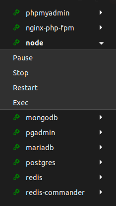

# Gnome Shell extension for Docker

This extension is a fork of this [extension](https://extensions.gnome.org/extension/1864/).

### What's added

- The ability to automatically determine the container shell
- Hide icon if no containers

## Usage

When installing this extension, you will be able to manage your docker containers.

The following actions are available :

- Start
- Stop
- Pause
- Restart
- Exec
- Remove

## Screenshot

## Installation

You can install this extension by following this [link](https://extensions.gnome.org/extension/1894/).

## Authors

- [webmastak](https://github.com/webmastak)
